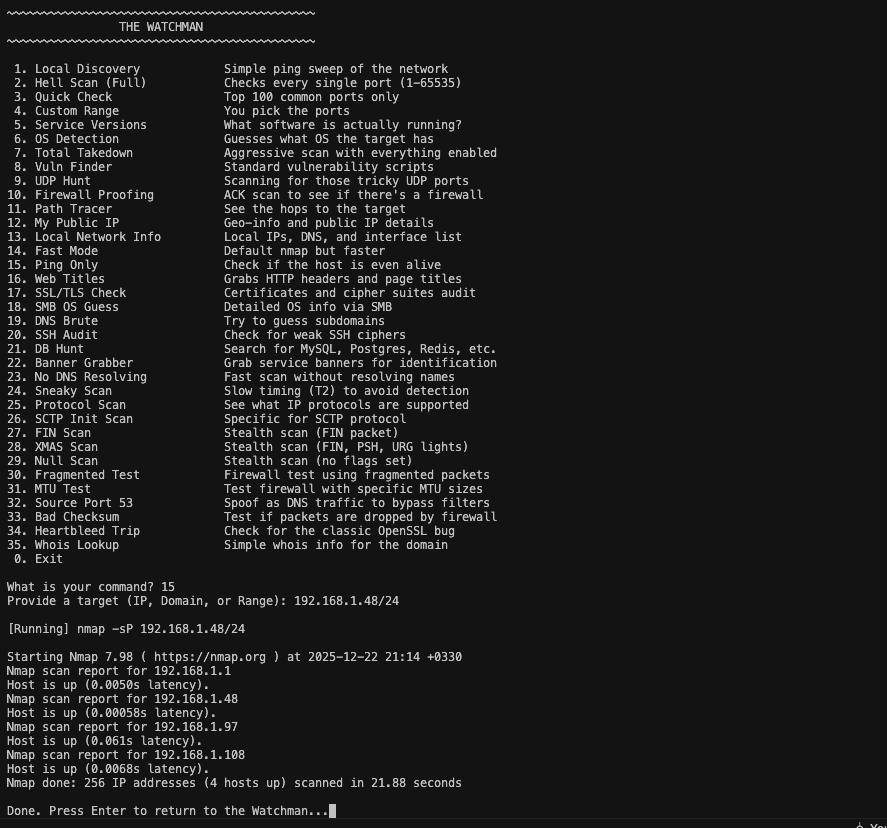

# THE WATCHMAN - Network Guardian

**The Watchman** is a terminal-based network scanner written in Go.
It wraps **Nmap** into a simple interactive menu so you don’t have to remember flags, scripts, or arcane syntax.

> ✨ For latest updates, check out the [dev](https://github.com/danial2026/the_watchman/tree/dev) branch ✨



## What it can do

* Discover hosts on a local network
* Check if machines are alive
* Get public IP and ISP info
* Find subdomains
* Run common vulnerability checks
* Audit SSL/TLS and SSH
* Test firewall behavior
* Perform stealth scans
* Detect databases and services
* Identify service versions and web titles

## Requirements

* **Go 1.21+**
* **Nmap**

  * macOS: `brew install nmap`
  * Arch Linux: `sudo pacman -S nmap`

---

### Build and Run

```bash
bash run.sh
```

Select a tool by number and run it.
If a scan needs root access, the tool handles `sudo` automatically on macOS and Linux.

---

## ⚠️ Important

I don’t condone doing bad things.
Don’t hack people. Don’t scan random networks.

Use this **only** on systems you own or have explicit permission to test.
