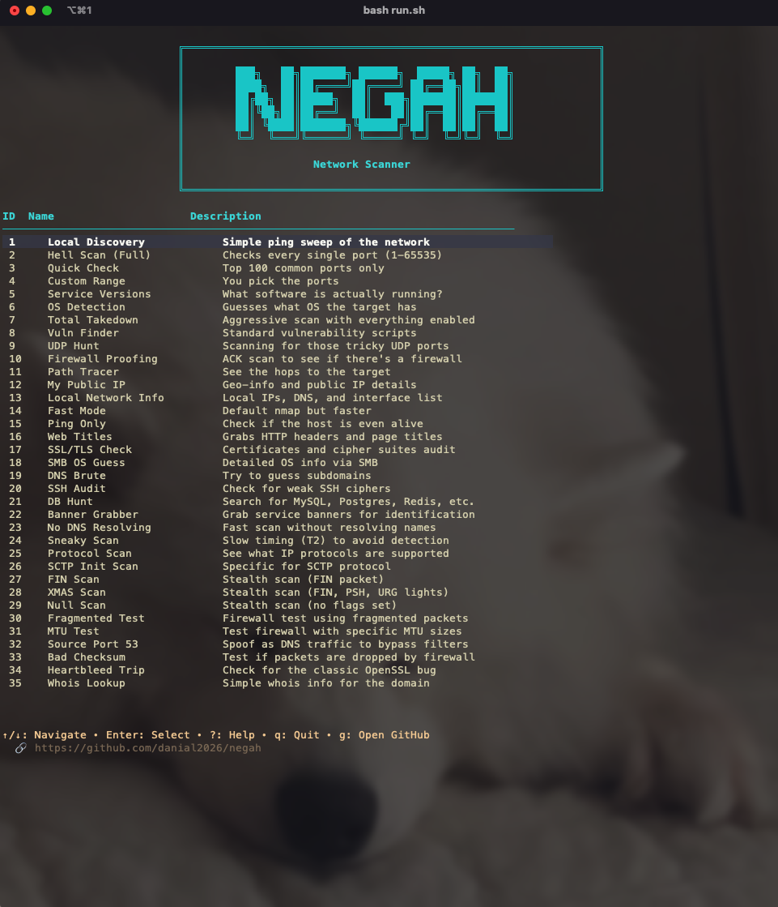

# NEGAH

**Negah** is a beautiful terminal-based network scanner written in Go

> ✨ For latest updates, check out the [dev](https://github.com/danial2026/negah/tree/dev) branch ✨



## ✨ Features

### Network Scanning Capabilities

* 🔍 Discover hosts on a local network
* 💓 Check if machines are alive
* 🌐 Get public IP and ISP info
* 🔎 Find subdomains
* 🛡️ Run common vulnerability checks
* 🔐 Audit SSL/TLS and SSH
* 🚧 Test firewall behavior
* 🥷 Perform stealth scans
* 🗄️ Detect databases and services
* 📊 Identify service versions and web titles

## Requirements

* **Go 1.21+**
* **Nmap**
  * macOS: `brew install nmap`
  * Arch Linux: `sudo pacman -S nmap`
  * Ubuntu/Debian: `sudo apt install nmap`

---

## 🚀 Build and Run

```bash
bash run.sh
```

Or build manually:

```bash
go build -o nscanner
./nscanner
```

---

## ⌨️ Keyboard Shortcuts

### Menu View

* `↑/↓` or `j/k` - Navigate through scan options
* `Enter` - Select a scan
* `q` - Quit application
* `?` - Toggle help menu

### Input View

* `Enter` - Confirm and continue
* `Esc` - Back to menu

### Result View

* `c` - **Copy results to clipboard**
* `Enter` or `Esc` - Back to menu

### Global

* `?` - Toggle help menu
* `Ctrl+C` - Force quit

---

## ⚠️ Important

I don't condone doing bad things.
Don't hack people. Don't scan random networks.

Use this **only** on systems you own or have explicit permission to test.
